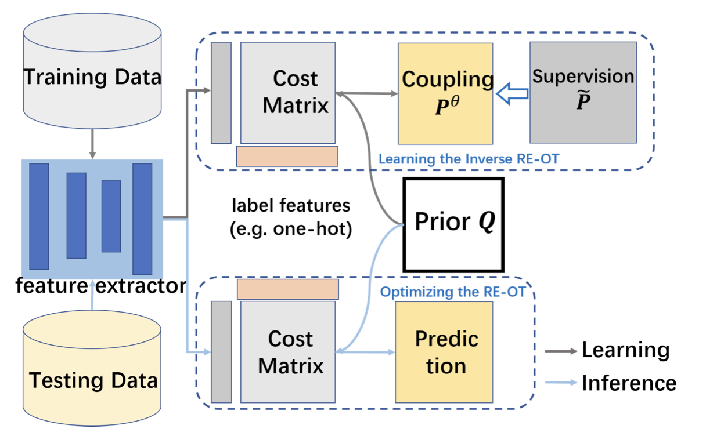

<br />
<p align="center">
    <h1 align="center">
        Relative Entropic Optimal Transport: a (Prior-aware) Matching Perspective to (Unbalanced) Classification
    </h1>
    <p align="center">
        <a href="">Liangliang Shi</a>,
        <a href="https://www.haoyuzhen.com">Haoyu Zhen</a>,
        <a href="https://www.gu-zhang.com">Gu Zhang</a>,
        <a href="https://thinklab.sjtu.edu.cn">Junchi Yan</a>,
    </p>
    <h2 align="center">
        NeurIPS 2023
    </h2>
    <p align="center">
        
    </p>
</p>

# Citation

If you find our work useful in your research, please consider citing:

```bibtex
@inproceedings{shi2023relative,
  title={Relative Entropic Optimal Transport: a (Prior-aware) Matching Perspective to (Unbalanced) Classification},
  author={Shi, Liangliang and Zhen, Haoyu and Zhang, Gu and Yan, Junchi},
  booktitle={Thirty-seventh Conference on Neural Information Processing Systems},
  year={2023}
}
```